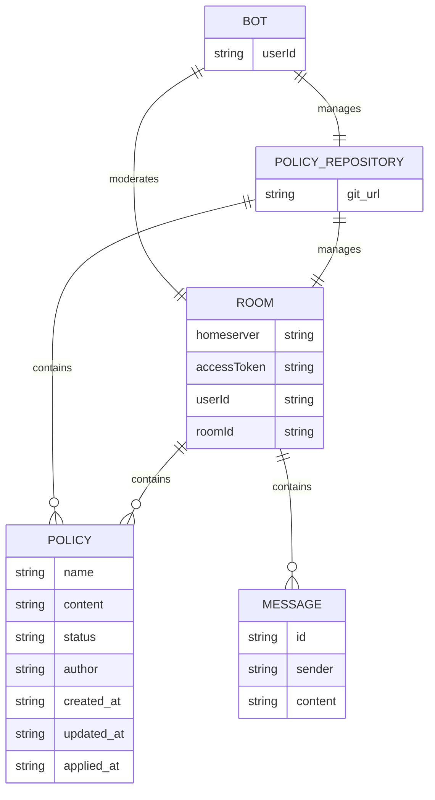

# Evolution Collective Moderation (ECM) Bot
**IMPORTANT:** This repository contains a work in progress. Expect nothing to work.
## About
The ECM bot is a reference implemenation of the proposed design pattern found [here](https://github.com/bgrayburn/Evolutionary-Collective-Moderation-Design-Pattern/blob/main/DesignPattern.md). Its main purpose to is collect proposed natural language moderation policies from users in the channel, use a voting system to transition them to the `accepted` status, then apply them to the channel. The reference implementation uses Matrix as the communication layer, and Git to as a policy store.
For the reference implementation, a bot implementaiton only supports a single chat room.

## Design

## Setup

## Usage

## Todos
- [X] add the ability to update the policies using natural language
- [X] use zod unions to specify objects for each action
- [ ] use zod to validate command messages and provide meaningful feedback
- [ ] add voting system
- [X] add chat history to prompt context
- [ ] add help for specific commands
- [ ] add the ability to direct chat users to instruct them why actions were taken against them
- [ ] add tests
- [ ] add E2E support
- [ ] Add spaces support (multiple rooms)?
- [ ] Add matrix server class?
- [ ] Human overrides for bot decisions?
- [ ] Add the ability for the bot to manage room state (ex. topic)?

## Open Questions
- Can GPT suggest when policies are ambiguous?
- Currently updates reset the clock on a currently proposed policy. Should it?
- Currently only 1 proposed update on a policy can exists, meaning that new proposals overwrite old ones. Should it?
- What about policies like *no speaking ill of people in the chat room?*. This would require the bot to have a way to identify people in the chat room.

